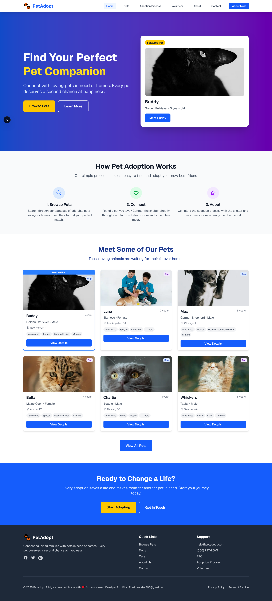

# 🐾 PetAdopt - Pet Adoption Platform



A comprehensive, modern **frontend-only** web application built with Next.js that connects loving families with pets in need of homes. This platform serves as a bridge between animal shelters and potential adopters, making the pet adoption process simple, transparent, and effective.

> **⚠️ IMPORTANT: This is a frontend-only application with mock data. It does not include a backend server or database. Shelters will need to integrate their own backend systems for full functionality.**

## 🚨 **IMPORTANT NOTICE - FREE FOR SHELTER HOUSES**

**This web application is completely FREE for shelter houses and animal rescue organizations to use. It is provided as a public service to help more pets find loving homes.**

### ⚠️ **USAGE RESTRICTIONS:**

- ❌ **NO SELLING ALLOWED** - This application must never be sold or commercialized
- ❌ **NO MODIFICATIONS FOR COMMERCIAL PURPOSES** - Do not modify this code for selling to shelters
- ✅ **FREE USE FOR SHELTERS** - Animal shelters and rescue organizations can use this freely
- ✅ **OPEN SOURCE CONTRIBUTIONS** - Improvements and contributions are welcome
- ✅ **NON-PROFIT USE** - Educational and non-profit use is encouraged

**This platform was created to help animals find homes, not to generate profit. Please respect this mission.**

---

## 🌟 **Key Features**

### 🏠 **For Pet Seekers**

- **Advanced Pet Search & Filtering**

  - Search by name, breed, species, age, location
  - Filter by gender, size, temperament, special needs
  - Filter by shelter, tags, and adoption requirements
  - Real-time search with instant results

- **Comprehensive Pet Profiles**

  - Multiple high-quality photos with image gallery
  - Detailed pet descriptions and personality traits
  - Complete health and vaccination records
  - Behavioral notes and training information
  - Shelter contact information

- **User-Friendly Interface**
  - Responsive design for all devices
  - Grid and list view options
  - Featured pet highlighting
  - Easy navigation with breadcrumbs
  - Accessibility features (ARIA labels, keyboard navigation)

### 🏢 **For Shelters**

- **Pet Management System**

  - Easy pet profile creation and management
  - Multiple image upload support
  - Comprehensive pet information tracking
  - Tag-based categorization system

- **Contact Management**
  - Direct contact forms for each pet
  - Automated inquiry routing
  - Contact information display
  - Email and phone integration

### 📱 **Core Application Features**

#### 🔍 **Pet Discovery**

- **Browse Pets Page** - Complete pet listing with advanced filters
- **Pet Detail Pages** - Individual pet profiles with full information
- **Search Functionality** - Real-time search across all pet data
- **Featured Pets** - Highlighted pets on homepage

#### 📋 **Adoption Process**

- **Step-by-Step Adoption Guide** - 7-step comprehensive process
- **Adoption Requirements** - Clear eligibility criteria
- **Adoption Fees Information** - Transparent pricing structure
- **FAQ Section** - Common questions and answers

#### 🤝 **Community Engagement**

- **Volunteer Opportunities** - 8 different volunteer roles
- **Volunteer Application Process** - Streamlined 5-step process
- **Impact Statistics** - Showcase of volunteer contributions
- **Testimonials** - Real volunteer experiences

#### 📞 **Support & Information**

- **Contact System** - Multiple contact methods
- **Contact Forms** - Integrated inquiry system
- **Office Hours** - Clear availability information
- **Emergency Support** - 24/7 emergency contact

#### ℹ️ **About & Transparency**

- **Mission Statement** - Clear organizational purpose
- **Impact Statistics** - Quantified success metrics
- **Team Profiles** - Meet the team behind the platform
- **Values & Principles** - Organizational core values

### 🛠 **Technical Features**

#### 🎨 **User Experience**

- **Modern UI/UX Design** - Clean, intuitive interface
- **Responsive Design** - Works on all screen sizes
- **Fast Loading** - Optimized images and performance
- **Accessibility** - WCAG compliant features
- **SEO Optimized** - Search engine friendly

#### 🔧 **Developer Features**

- **Next.js 15** - Latest React framework
- **React 19** - Modern React features
- **TailwindCSS** - Utility-first CSS framework
- **TypeScript Ready** - Type-safe development
- **Component Architecture** - Reusable UI components
- **Frontend Only** - No backend dependencies required

#### 📊 **Data Management (Frontend Only)**

- **Mock Data System** - Comprehensive sample data stored in JavaScript files
- **Static Pet Database** - All pet information stored in `src/data/pets.js`
- **No Backend Required** - All data is client-side, no server needed
- **Shelter Directory** - Static partner shelter listings
- **Breed Categories** - Organized by species in static files
- **Tag System** - Flexible categorization system

> **📝 Note**: All contact forms and data submissions are currently simulated. To make this fully functional, you'll need to integrate with a backend service, database, and email system.

## 🚀 **Getting Started**

### Prerequisites

- Node.js 18+
- npm, yarn, pnpm, or bun

### Installation

1. **Clone the repository**

   ```bash
   git clone <repository-url>
   cd pet-adoption
   ```

2. **Install dependencies**

   ```bash
   npm install
   # or
   yarn install
   # or
   pnpm install
   # or
   bun install
   ```

3. **Run the development server**

   ```bash
   npm run dev
   # or
   yarn dev
   # or
   pnpm dev
   # or
   bun dev
   ```

4. **Open your browser**
   Navigate to [http://localhost:3000](http://localhost:3000) to see the application.

## 📁 **Project Structure**

```
pet-adoption/
├── src/
│   ├── app/                    # Next.js App Router pages
│   │   ├── page.js            # Homepage
│   │   ├── about/             # About page
│   │   ├── adoption-process/  # Adoption process guide
│   │   ├── contact/           # Contact page
│   │   ├── faq/              # FAQ page
│   │   ├── pets/             # Pet listing and details
│   │   ├── privacy-policy/   # Privacy policy
│   │   ├── terms-of-service/ # Terms of service
│   │   └── volunteer/        # Volunteer opportunities
│   ├── components/           # Reusable UI components
│   │   ├── ContactForm.jsx   # Contact form component
│   │   ├── FilterPanel.jsx   # Pet filtering component
│   │   ├── Footer.jsx        # Site footer
│   │   ├── GoToTop.jsx       # Scroll to top button
│   │   ├── Navbar.jsx        # Navigation component
│   │   ├── PetCard.jsx       # Pet display card
│   │   └── SearchBar.jsx     # Search functionality
│   └── data/
│       └── pets.js           # Sample pet data
├── public/
│   └── images/               # Pet and site images
└── README.md
```

## 🎯 **Pages & Functionality**

### 🏠 **Homepage (`/`)**

- Hero section with featured pet
- How adoption works (3-step process)
- Recent pets showcase
- Call-to-action sections

### 🐾 **Pets Page (`/pets`)**

- Complete pet listing
- Advanced filtering system
- Search functionality
- Grid/list view toggle
- Sorting options

### 📄 **Pet Details (`/pets/[id]`)**

- Image gallery with navigation
- Complete pet information
- Health and behavior details
- Contact form integration
- Shelter information

### 📋 **Adoption Process (`/adoption-process`)**

- 7-step adoption guide
- Requirements checklist
- Adoption fees breakdown
- FAQ section

### 🤝 **Volunteer (`/volunteer`)**

- 8 volunteer opportunity types
- Benefits of volunteering
- Application process
- Volunteer testimonials
- Impact statistics

### ℹ️ **About (`/about`)**

- Mission and story
- Impact statistics
- Team member profiles
- Core values
- How we help section

### 📞 **Contact (`/contact`)**

- Multiple contact methods
- Contact form with topic selection
- FAQ section
- Office hours
- Emergency contact info

### ❓ **FAQ (`/faq`)**

- 15 comprehensive Q&A pairs
- Quick links to other pages
- Contact options for additional help

## 🎨 **Design System**

### Color Palette

- **Primary Blue**: `#2563eb` (blue-600)
- **Secondary Purple**: `#7c3aed` (purple-600)
- **Accent Yellow**: `#fbbf24` (yellow-400)
- **Success Green**: `#059669` (green-600)
- **Text Gray**: `#374151` (gray-700)

### Typography

- **Font Family**: Geist (Vercel's font)
- **Headings**: Bold, large sizes for hierarchy
- **Body Text**: Regular weight, readable sizes
- **UI Text**: Medium weight for buttons and labels

## 🔧 **Customization**

### Adding New Pets

Edit `src/data/pets.js` to add new pet entries:

```javascript
{
  id: 9,
  name: "Pet Name",
  species: "Dog", // or "Cat", "Bird", "Other"
  breed: "Breed Name",
  age: 3,
  gender: "Male", // or "Female"
  location: "City, State",
  shelter: "Shelter Name",
  description: "Pet description...",
  healthNotes: "Health information...",
  behaviorNotes: "Behavior information...",
  images: ["/images/pet1.jpg", "/images/pet2.jpg"],
  tags: ["Vaccinated", "Trained", "Good with kids"],
  contactEmail: "shelter@email.com",
  contactPhone: "(555) 123-4567",
  featured: false
}
```

### Styling Customization

The application uses TailwindCSS for styling. Modify styles by:

- Editing component classes directly
- Updating `tailwind.config.js` for theme changes
- Adding custom CSS in `src/app/globals.css`

## 🔌 **Backend Integration Requirements**

**This is a frontend-only application.** To make it fully functional for production use, you'll need to integrate the following backend services:

### Required Backend Services

- **Database System** - Store pet information, shelter data, and user inquiries
- **Email Service** - Handle contact form submissions and notifications
- **File Upload Service** - Manage pet images and documents
- **User Authentication** - If you want user accounts and saved searches
- **Admin Panel** - For shelters to manage their pet listings

### Recommended Integration Options

- **Headless CMS**: Strapi, Sanity, or Contentful for pet data management
- **Backend-as-a-Service**: Firebase, Supabase, or AWS Amplify
- **Email Services**: SendGrid, Mailgun, or AWS SES
- **Image Storage**: Cloudinary, AWS S3, or similar cloud storage

### API Endpoints You'll Need

```javascript
// Example API endpoints to implement
GET /api/pets              // Get all pets
GET /api/pets/:id          // Get specific pet
POST /api/contact          // Handle contact form submissions
GET /api/shelters          // Get shelter information
POST /api/pets             // Add new pet (admin)
PUT /api/pets/:id          // Update pet (admin)
DELETE /api/pets/:id       // Remove pet (admin)
```

## 🌐 **Deployment**

### Vercel (Recommended)

1. Push your code to GitHub
2. Connect your repository to Vercel
3. Deploy automatically with each push

### Other Platforms

- **Netlify**: Connect GitHub repository
- **AWS Amplify**: Deploy from Git
- **Railway**: Simple deployment platform

## 🤝 **Contributing**

We welcome contributions to improve this platform for animal shelters worldwide!

### How to Contribute

1. Fork the repository
2. Create a feature branch (`git checkout -b feature/amazing-feature`)
3. Commit your changes (`git commit -m 'Add amazing feature'`)
4. Push to the branch (`git push origin feature/amazing-feature`)
5. Open a Pull Request

### Contribution Guidelines

- Follow existing code style and conventions
- Add comments for complex functionality
- Test your changes thoroughly
- Update documentation as needed
- Ensure accessibility standards are met

## 📄 **License**

This project is provided free for animal shelters and rescue organizations.

**Commercial use restrictions apply:**

- ❌ Cannot be sold or commercialized
- ❌ Cannot be modified for commercial sale to shelters
- ✅ Free use for non-profit animal welfare organizations
- ✅ Open source contributions welcome

## 🆘 **Support**

### For Shelters Using This Platform

> **Note**: The contact information shown is for demonstration purposes only. This is a frontend-only template that requires backend integration for full functionality.

- **Email**: help@petadopt.com _(Demo contact)_
- **Phone**: (555) PET-LOVE _(Demo contact)_
- **Emergency**: (555) PET-HELP (24/7) _(Demo contact)_

### For Developers

- Create an issue on GitHub
- Join our community discussions
- Check the documentation
- Need help with backend integration? Check our integration guide above

## 🙏 **Acknowledgments**

- Built with ❤️ for animal welfare organizations
- Thanks to all shelters working to help pets find homes
- Special thanks to volunteers who make pet adoption possible
- Inspired by the mission to connect every pet with a loving family

---

**Remember: This platform exists to help animals find homes. Please use it responsibly and keep it free for those who need it most - the shelters and the pets they care for.** 🐾❤️
